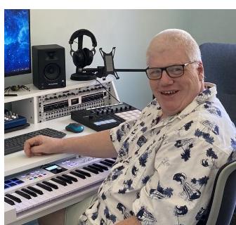

I am what is impolitely, but entirely correctly, referred to as a "graybeard".

I've been an embedded engineer on and off for over 40 years. I've worked with Motorola,Zilog, Hitachi, ARM and a swathe of now long-forgotten microcontrollers in that time. I also work with FPGAs, mostly Xilinx and especially the Zynq 7000 series.

These days I'm a principal engineer, so my main job is to draw pictures for others to code. This is why I do this hobby, like most programmers, I find hands-on coding both enjoyable and creative.

I'm a musician, once classically trained,who was seduced by the wages in 1983 to switch career. I performed as a keyboardist until the early 2000s and I've worked with many, now vintage, synthesisers during that time.

Audio DSP is just a hobby, it merges my two careers which I find exciting and challenging. As I head into retirement I need something to keep my brain active and perhaps generate an income stream - who knows?.

So, while I may be a little further along the learning curve than some, I don't claim to be a good, or even efficient, Audio DSP programmer.
